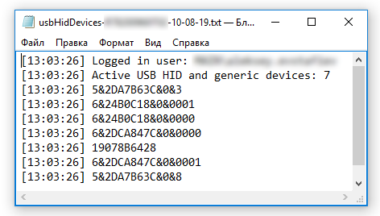

#  usbHidWatcher

- Version: 2.0
- Author: Alex Evstafiev
- Creation Date:  01.08.2019
- Purpose/Change: Inventory management and security
- PS Version: 5.0 

## Usage
    
The script collects unique identifiers USB devices (PNPId) of classes Microsoft HID (HidUsb) and USB Generic (usbccgp) using WMI Win32_UsbDevice class and writes it to a log file locally. This solution is used as an addition to the local zabbix agent user parameters configuration for inventory and security tasks.

## Setup

The script was developed for use by the task scheduler. For hidden launch, the run.vbs script is used. The frequency of execution is set on demand. 

## Collecting PNPId's

```PowerShell
$pnpId = @()

gwmi win32_usbdevice |
    ? {
        $_.Service -like 'usbccgp' -or 
        $_.Service -like 'HidUsb'
      } | 
      select -exp PNPDeviceID | 
      sls 'PID_.*?(?<=)[A-Z,0-9]\\(.*?)$' -AllMatches | 
    % {
        $pnpId += $_.Matches.groups[1]
       }
```

## Output example



## Scope

Barcode readers and heandled usb devices used for collect data, in Postal Services and POS terminals.